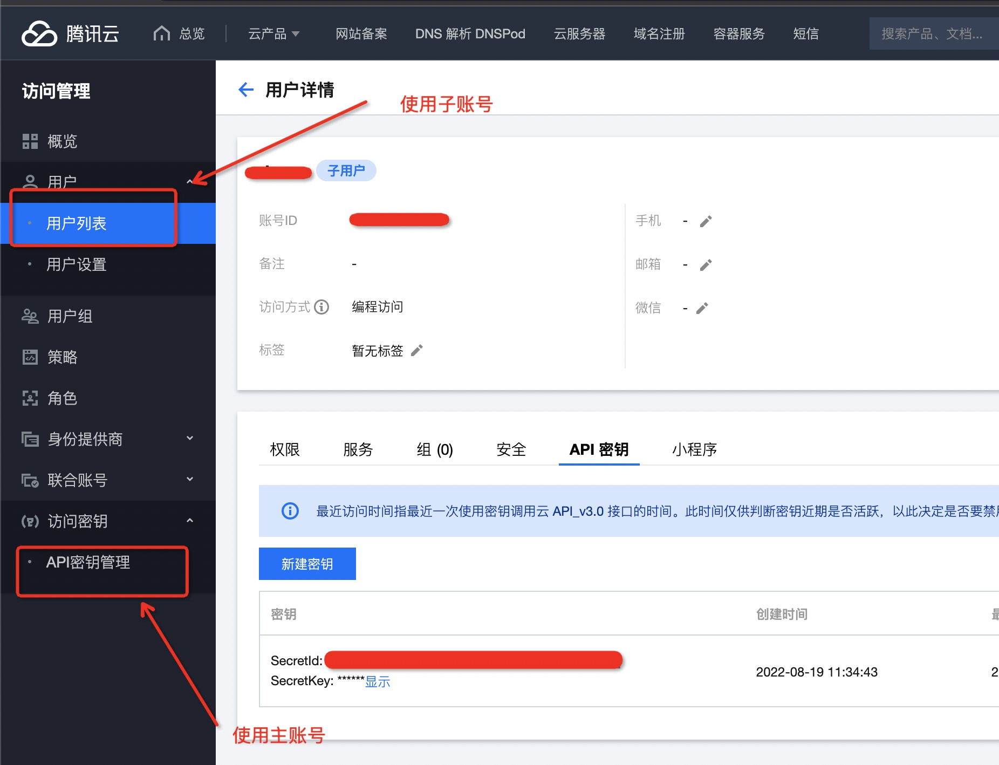
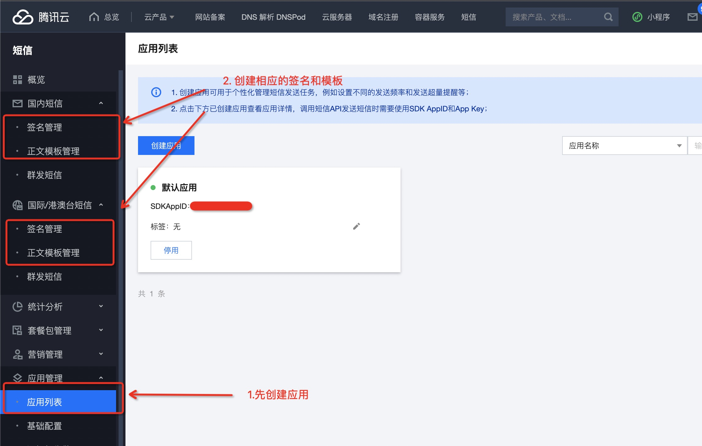
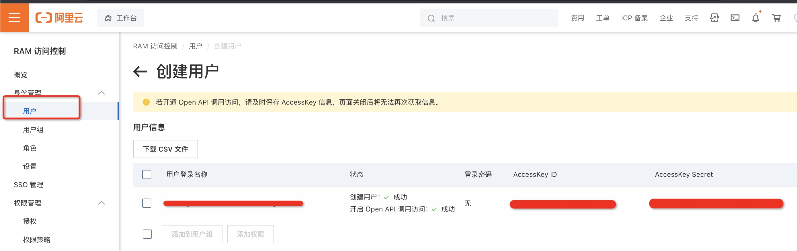
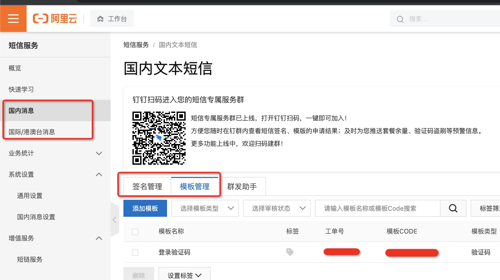

# sms-code-api-ts
使用 typescript 开发的发送短信验证码的程序。程序设计为微服务的形式，可方便的与其他服务集成。

开发环境：
  * node v16.13.0
  * yarn 1.22.15

## api 手册
  * POST /v1/sms        发送特定短信
```
请求query:
  provider: string;
    要使用的短信服务： tencent | aliyun；可为空
请求body：
  mobile: string;
    手机号格式 +[国家或地区码][手机号]；如：+17728000001；若未指定地区区码，默认使用国内的区码+86。
  templateId: string;
    要使用的短信模板
  extra: any;
    模板中对应的变量；若 provider 是 tencent 则需要传一个 array，若 provider 是 aliyun 则需要传一个 object
  signName: string;
    要使用的短信签名；可为空。

返回：
  执行成功则返回 200 状态码。
```
  * POST /v1/sms/send   发送验证码
```
请求参数：
  mobile: string;
    手机号格式 +[国家或地区码][手机号]；如：+17728000001；若未指定地区区码，默认使用国内的区码+86。
  templateId: string; (可选)
    要使用的短信模板

返回：
  执行成功则返回 200 状态码。
```

  * POST /v1/sms/check  检查验证码
```
请求参数：
  mobile: string; 手机号
  code: string; 验证码

返回：
  执行成功则返回 200 状态码。
```

## 启动服务
### 使用 docker 启动
`docker run -d -it -p 80 wusuopu/sms-code-api-ts`


### 通过源码启动
下载源代码之后，基于 `.env.example` 创建 `.env` 文件；

```
cd app/
yarn
yarn build
yarn start
```

## 相关配置
### 腾讯云
1.先获取调用 api 的 secretId 和 secretKey；  


2.再获取短信服务的 appId、签名内容以及模板ID；  


3.设置相关的环境变量；若没有国际短信的需求，相应的配置可留空。

```
# 腾讯云配置
SMS_PROVIDER = tencent
# 国内短信
TENCENT_SMS_APP_ID = appId
TENCENT_SECRET_ID = secretId
TENCENT_SECRET_KEY = secretKey
TENCENT_SMS_TEMPLATE = 模板ID
TENCENT_SMS_SIGN = 签名内容
# 国际/港澳台短信
TENCENT_SMS_APP_ID2 = appId
TENCENT_SECRET_ID2 = secretId
TENCENT_SECRET_KEY2 = secretKey
TENCENT_SMS_TEMPLATE2 = 模板ID
TENCENT_SMS_SIGN2 = 签名内容
```


### 阿里云
1.先获取调用 api 的 accessKeyId 和 accessKeySecret；  


2.再获取短信服务的签名名称和模板CODE；  


3.设置相关的环境变量；若没有国际短信的需求，相应的配置可留空。

```
# 阿里云配置
SMS_PROVIDER = aliyun
# 国内短信
ALI_API_KEY = accessKeyId
ALI_API_SECRET = accessKeySecret
ALI_SMS_TEMPLATE = 模板CODE
ALI_SMS_SIGN = 签名名称
# 国际/港澳台短信
ALI_API_KEY2 = accessKeyId
ALI_API_SECRET2 = accessKeySecret
ALI_SMS_TEMPLATE2 = 模板CODE
ALI_SMS_SIGN2 = 签名名称
```

其他配置

```
# 存储选择 redis 或者  leveldb
STORAGE_PROVIDER = redis | leveldb
REDIS_URL = redis://redis:6379/1
REDIS_KEY_PREFIX = sms-ts:
LEVELDB_PATH = tmp/leveldb

SMS_MOCK_ACCOUNTS =

# 沙盒模式下只生成验证码，不会实际发送短信，默认 false
SMS_SANDBOX = true | false
# 是否暂停发送功能，默认 false
SMS_DISABLED = true | false
# 在 disabled 状态下可使用该临时验证码进行验证
SMS_TEMP_CODE =

# 验证码有效期（秒）
SMS_TTL = 600
# 两次发送的时间间隔（秒）
SMS_INTERVAL = 60
```
